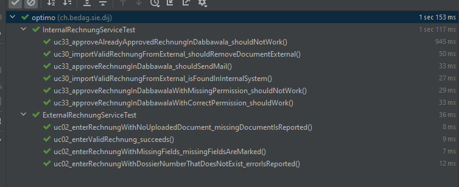

# Was

Ist mal ein draft / entwurf mit einigen ideen, was ich empfehle anders / besser zu machen als in eKFSG. Ist jetzt nicht was fertiges was 1:1 so übernommen werden kann, wirklich nur ne ideensammlung.

Was kann dieses Demo (nur `backend` ist implementiert): Spezifikation etwas vereinfacht und gewisse Dinge sind ausgelassen, aber grundsätzlich kann es das:

 * Eingabe einer Rechnung über das Öffetnlichkeitsmodul (neuer name für Externer Zugang) (inklusive PDF-Dokument).
 * Validierung (einige Felder, nicht alles) dieser eingegebenen Rechnung.
 * Persistierung dieser Rechnung in der Datenbank.
 * Datenimport dieser Rechnung & Dokument von Externer Zugang zu Interner Zugang (Dabbawala). (hinweis: geht in diesem Demo direkt über die Services; müssten in realtät über die HTTP-Apis laufen).
 * Speichern der importierten Rechnung im internen Zugang; speichern der Rechnungs-Dokumentes (z.b. PDF) im Dabbawala-Dokument-Store.
 * Freigeben einer Rechnung in Dabbawala (inkl. Rechte-Überprüfung, Status-Überprüfung und Mailversand).

...inkl. Tests.

## Grundsätze

Eigentlich das von hier: https://confluence.bedag.ch/display/~simon.ruoss@bedag.ch/Notes+1.4

### Testing

Glaube das schönste ist, dass wir nun durchgängig vom Öffentlichkeitsmodul bis ins CMI alles testen können. Code siehe hier (**bitte genau anschauen!**):

 * `ExternalRechnungServiceTest` (hier ist eher wenig).
 * `InternalRechnungServiceTest` (das ist das interessante!).



... schön ist auch, dass ich oft Use-Case-Funktionalität implementieren kann, ohne irgend welche Umsysteme hochziehen zu müssen (ich konnte hier in diesem Demo doch schon einiges an Funktionalität implementieren ohne irend was mit Dabbawala, CMI oder einem Mail-Versender gemacht zu haben). Kein Dabbawala, kein CMI, ... Bugfixing sollte so relativ einfach und schnell gehen / auch kleinere Änderungen sollten so schnell implementierbar sein; kleiner Test schreiben und das Zeugs implementieren... solle (falls alles wie angedacht klappt) deutlich an Zeit einsparen (und hoffentlich auch die Qualität erhöhen).

Einige Beispiele aus den Tests:

 * Validierung kann getestet werden (fehlen Felder; invalide Daten).
 * Daten import/export wird in den Tests getestet (Öffentlichkeitsmodul / Dabbawala)
 * Werden nach dem import die daten im externen Zugang gelöscht?
 * Das korrekte Abfragen von berechtigungen (beim Approven von rechnungen) wird getestet ("darf ich ne rechnung freigeben"?).
 * Ist die rechnung im richtigen status fürs approven?
 * Wird eine E-Mail verschickt, falls eine Rechnung approved wird?

### Möglichst viel vom UI ins Backend

Ich schlage vor, möglichst viel vom UI ins Backend zu verlagern, das UI möglichst dumm halten. Wieso:

 * Testing, Testing, Testing! :-) wie hier gezeigt wird, macht das das Testing sehr einfach, wenn wir alles zusammen im backend haben und wenig Logik im UI.
 * Änderungen / changes können schnell implementiert werden (eine Stelle; Test anpassen; wenig Gefahr, dass was vergessen geht).  
 * Es handelt sich ja um eine Fachanwendung, spätestens nach einer Woche wissen die Leute was Mandatory ist und wie die Felder aussehen müssen.
 * Sind ja nicht millionen von Requests, lieber mal nen Request zuviel an den Server schicken und den dort validieren lassen...

Implikationen für den Endbenutzer:

Aktionen ("Speichern", "Löschen", "Freigeben", ...) werden im allgemeinen (man kann immer noch Ausnahmen machen, dort wo der Kunde sich das wünscht) immer aktivierbar sein, auch wenn man keine Rechte hat oder noch nicht alles ausgefüllt hat:

 * D.h. so was wie in der Spez wird es nicht geben: "_Das System lässt den Button "Speichern" deaktiviert, er wird nicht aktiv resp. klickbar._" (https://confluence.bedag.ch/display/DIJ/UC20+Antrag+Kostengutsprache+erstellen)
 * Der Benutzer kann immer auf "Speichern" klicken, erhält dann aber Meldungen, wenn Felder noch nicht ausgefüllt sind oder sonst ungültige Daten haben (oder der Benutzer nicht die benötigten rechte hat).
 * Mandatory-Felder werden Client-Seitig lediglich durch einen roten * markiert.

Technische Details:

Ich empfehle gleich soweit zu gehen dem Client sogar die übersetzen Validierungsmeldungen zurückzuschicken.

 * Siehe `ValidationException`.
 * Die `ValidationException` hat in den Messages auch noch nen Key (nebst den Texten), falls wir doch die eine oder andere Validierungsmeldung auf dem Client speziell darstellen müssen.
 * ... aber im allgemeinen (wenn vom Kunden keine Spezialanforderung komme) kann dann eine `ValidationException` einfach in einer generischen UI-Komponenten unterhalb der Formulare dargestellt werden.
 * ... wie in den Tests zu sehen ist, kann das relativ einfach getestet werden.

```java
  ValidationExceptionChecker.assertHasExactlyGivenValidationErrors(() -> externalRechnungService.saveRechnung(enteredRechnung),
     ExternalRechnungService.VALIDATION_MISSING_RECHNUNG_DOCUMENT,
     ExternalRechnungService.VALIDATION_MISSING_DOSSIER_NUMBER);
```

### Backend zusammen gelegt

Dadurch, dass wir das Backend hier für interner-Zugang und externer-Zugang nun in einem haben, ist es einfach das zeugs durchgängig zu testen: von der eingabe einer rechnung im externen zugang bis zum speichern und dabbawala + freigabe + mailversand (und auch weiterleitung am CMI; ist hier im beispiel nicht implementiert).

### Möglichst 1:1 Mapping von Use-Case zu Service.

Sollten IMHO möglichst ein 1:1 Mapping von Use-Case zu den Service-Methoden haben. Und den Service-Methoden wirklich nur das liefern, was sie auch benötigen. Keine riesigen pojos (wo dann die hälfte der felder `null` sind), sondern einfach die Daten welche sie zur Durchführung benötigen. Hier als beispiel die Freigabe einer Rechnung (siehe `InternalRechungService`):

```java
  public void approve(RechnungId id) {
    // <..>
  }
```

...die APIs dann entsprechend, möglichst ne 1:1 Weiterletung an die Service-Methode, hier auszug vom `ExternalRechnungApi`:

```java
  @PostMapping("/userEnteredRechnung")
  public ResponseEntity<RechnungId> userEnteredRechnung(EnteredRechnung rechnung) {
    var id =  service.saveUserEnteredRechnung(rechnung);
    return ResponseEntity.ok(id);
  }
```

## Sonstiges

 * Die simulatoren / mocks könnten eigentlich auch in den `test` bereich verschoben werden, die müssen nicht zwingend im produktivcode sein.
 * Wenn man weitere Systeme braucht (wie Dabba), dann soll das einfach hochziehbar sein.

## Naming

 * Ich hab mal die namen `Internal` für das interne modul genommen (in spez Prozessplatform) (https://confluence.bedag.ch/display/DIJ/02+Prozessplattform)
 * ... und den namen `External` für das Öffentlichkeitsmodul (https://confluence.bedag.ch/pages/viewpage.action?pageId=204210411).

... finde beide namen in der Spez nicht so optimal für die benamsung im code. Da müsste man sich vielleicht noch was überlegen. 

## Import/Export

### ID Sharing

Schauen wir, dass die Entities intern und extern immer dieselbe UUID behalten? Ich würde eher sagen ja: So können wir sicher sein, wenn der Import abbricht und dann noch mal durchgeführt wird, dass wir keine Duplikate haben.

## Naming

### Internal / External Prefixing?

Die meisten pojos können für den externen und internen zugang geshared werden, jedoch nicht immer. Was machen wir da vom naming her:

 * Lassen den namen, dann haben wir halt zum teil 2 pojos welche `Rechnung` heissen (dann schaut man beim importieren; ggf. alias import; hinweis: für andere Dinge wie Services, Entities oder Repositories geht das nicht, da motzt Spring).
 * Wir prefixen die, wenn ja, wie? Vorschlag:
   * `InternalRechnung`
   * `ExternalRechnung` 
 * Gilt auch für Tabellen-Namen: Gewisse tabellen sind identisch (intern / extern) - z.b. für Daten welche wir von CMI abzhügeln und stammdaten, gewisse jedoch nicht.  